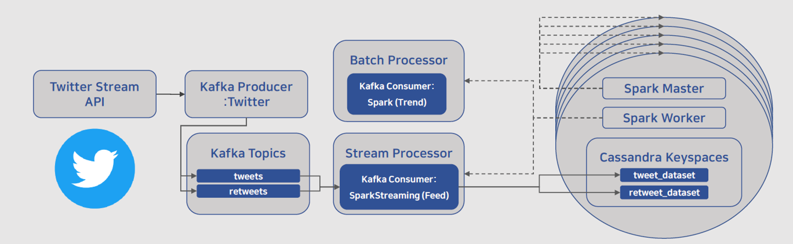

# Data Pipeline
> **Filter realtime Tweets API**로부터 데이터를 받아 **Kafka**에 쌓고, 
> **Spark**로 데이터 변형 후 **Cassandra**에 저장하는 파이프라인

## 🖼 Architecture


## 🛠 Install & Configuration
Master Node cluster 1개와 Slave Node cluster 4개로, 총 5개의 클러스터 노드로 구성하였다. Cassandra DB의 keyspace는 replication strategy는 NetworkTopologyStrategy, replication factor는 3, consistency level은 LOCAL_QUORUM이다.

&nbsp;

For hardware choices first see:
- [Spark recommendations](https://spark.apache.org/docs/0.9.0/hardware-provisioning.html)
- [Cassandra recommendations](http://cassandra.apache.org/doc/latest/operating/hardware.html)

### Prerequisites and used versions
- CentOS Linux release 7.7.1908
- Java 8
- Cassandra 3.11.5
- cqlsh 5.0.1
- Spark 2.4.4 built for Hadoop 2.7
- Hadoop 2.7.7
- kafka_2.11-2.1.1

### Cassandra Install
[REFERENCE](https://www.digitalocean.com/community/tutorials/how-to-run-a-multi-node-cluster-database-with-cassandra-on-ubuntu-14-04)
#### **Step 1 — Install Cassandra (on all node) or Deleting Default Data**
```javascript
> mkdir ~/Download

> curl "http://archive.apache.org/dist/cassandra/3.11.5/apache-cassandra-3.11.5-bin.tar.gz" -o ~/Downloads/cassandra.tgz

> mkdir ~/Apache && mkdir ~/Apache/cassandra && cd ~/Apache/cassandra

# We specify the --strip 1 flag to ensure that 
# the archive’s contents are extracted in ~/kafka/ itself 
# and not in another directory (such as ~/kafka/kafka_2.11-2.1.1/) inside of it.
> tar -xvzf ~/Download/cassandra.tgz --strip 1

// OR

> sudo service cassandra stop

> sudo rm -rf ~/cassandra/data
```
#### Step 2 — Configuring the Cluster
```javascript
// ~/cassandra/cassandra.yaml
...
cluster_name: 'Cluster00'
...
seed_provider:
  - class_name: org.apache.cassandra.locator.SimpleSeedProvider
    parameters:
         - seeds: "10.240.14.37, 10.240.14.38, 10.240.14.39, 10.240.14.40, 10.240.14.41"
...
listen_address: your_server_ip
...
rpc_address: your_server_ip
...
endpoint_snitch: GossipingPropertyFileSnitch
...
auto_bootstrap: false
```

#### Step 3 — Configuring the Firewall
- ***PASS***
- ***방화벽 해제***

#### Step 4 — Check the Cluster Status
```javascript
> sudo nodetool status
```
***Output***
```javascript
Datacenter: datacenter1
=======================
Status=Up/Down
|/ State=Normal/Leaving/Joining/Moving
--  Address      Load       Tokens       Owns    Host ID                               Rack
UN  192.168.1.4  147.48 KB  256          ?       f50799ee-8589-4eb8-a0c8-241cd254e424  rack1
UN  192.168.1.6  139.04 KB  256          ?       54b16af1-ad0a-4288-b34e-cacab39caeec  rack1

Note: Non-system keyspaces don't have the same replication settings, effective ownership information is meaningless
```
***If you can see all the nodes you configured, you’ve just successfully set up a multi-node Cassandra cluster.***


## Reference
- [twitter-topics](https://github.com/adrianva/twitter-topics)
- [Twitter-Sentiment-Analysis-Using-Spark-Streaming-And-Kafka](https://github.com/sridharswamy/Twitter-Sentiment-Analysis-Using-Spark-Streaming-And-Kafka)
- [SparkPipeline](https://github.com/mavoll/SparkPipeline)
